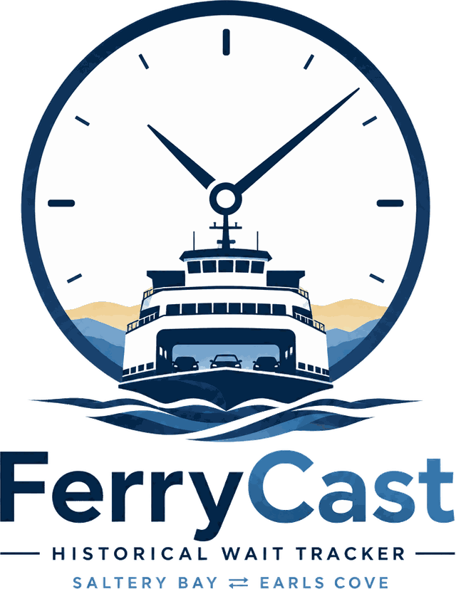

<p align="center">
  <picture>
    <source media="(prefers-color-scheme: dark)" srcset="brand/logo-readme.png">
    
  </picture>
</p>

# FerryCast

Historical wait tracker for the **Saltery Bay ⇄ Earls Cove** ferry route.

The route is first-come-first-served with ~2-hour headways, so missing a sailing costs 2+
hours — and there is no published record of how often that happens. On busier routes BC
Ferries publishes a live deck-space percentage; **this route has never once carried one**
(2,368 rows scraped, zero percentages), and one of its two terminals has no departures board at
all. Even where that percentage does exist it describes space aboard the vessel and
excludes the vehicles still queued outside — the exact number a traveller needs.

So FerryCast builds the record nobody publishes: for every sailing, whether it ran out of
room and when, assembled from the departures board where there is one, the operator's own
capacity notes, the live vessel tracker, the terminal camera, and people who were in the
line. Then it answers *"on a day like today, what's the wait?"* from comparable past
sailings. Where a camera has been calibrated it reads the compound directly — how many lanes
are occupied, every few minutes, for nothing.

It is a retrieval system, not a forecaster. Similarity search is the model.

---

## Status

| Req | What it does | State |
|-----|--------------|-------|
| R1 | Frame capture from both terminal webcams | ✅ Built — archived by default, every 5 min |
| R2 | Conditions-page scrape, both directions | ✅ Built — but this route publishes a departures board and nothing else, at one end only |
| R3 | Vision extraction to structured JSON, batchable and idempotent | ✅ Built — runs when you ask |
| R4 | Sailing-level aggregation: peak queue, carryover, overload | ✅ Built |
| R5 | "Day like today" query UI, mobile-friendly | ✅ Built |
| P1 | Arrival-curve view | ✅ Built — drawn from lane occupancy |
| P1 | Event calendar tags (auto long weekends + manual) | ✅ Built |
| P1 | Anomaly digest (`ferrycast health`) | ✅ Built |
| P1 | Backfill from service notices | ⚠️ CSV importer only — see [Not built](#not-built) |
| — | First-hand reports from the line, and check-in from it | ✅ Built — see [Reporting](#reporting-a-sailing-you-were-on) |
| — | Free geometric camera reading (`lanes`) | ✅ Built at Saltery Bay — runs on every capture |
| — | Vessel tracking, where there is no departures board | ✅ Built — see [Departures](#departures-and-who-saw-them) |
| — | Marine and shore forecasts (ECCC) | ✅ Built — shown beside the sailings |

**Before this collects anything you must fill in the real sailing timetable**, and the
webcam URLs too if you want any camera reading at all. Both are configuration, not code.
See [Setup](#setup).

---

## Setup

```bash
pip install -e .

cp config/ferrycast.example.toml config/ferrycast.toml
cp config/schedule.example.toml  config/schedule.toml
```

Then edit both files:

1. **`config/ferrycast.toml` → `webcam_url` for each terminal.**
   BC Ferries' terminal cameras publish a still JPEG at
   `https://ccimg.bcferries.com/cc/support/terminals/cam1_<CODE>.jpg`, where `<CODE>` is the
   terminal code — so `cam1_SLT.jpg` and `cam1_ERL.jpg` for this route. It has to be the
   camera *image* at a fixed address, not the page that embeds it, and you should satisfy
   yourself that low-rate access is acceptable use.

   Treat this as required rather than optional on this route. What BC Ferries publishes here
   is thin — a departures board at one terminal and nothing at the other — so outside the
   hours that board is speaking, the camera is the only evidence there is. Once a terminal is
   calibrated every captured frame is read geometrically, free, on every capture. See
   [Reading a camera for nothing](#reading-a-camera-for-nothing).

2. **`config/schedule.toml` → the real departure times.**
   The shipped times are plausible placeholders, **not** a published timetable. A wrong
   departure time silently mis-windows every observation around it, so check each one.

3. **Optional: `vessel_tracking_url`, and `outbound_bearing` on each terminal.**
   BC Ferries publishes a departures board for one end of this route and none whatever for
   the other, so without this the homeward direction has no source of a departure time at
   all — and a residual queue read against the timetable counts vehicles still boarding a
   late sailing as vehicles left behind.

   ```toml
   [route]
   vessel_tracking_url = "https://ccimg.bcferries.com/cc/support/vessels/route29.html"

     [[route.terminals]]
     code             = "SLT"
     outbound_bearing = "E"    # which way the ship points once it has left here
   ```

   The tracker names no port — it reports each vessel as stopped or under way, with a compass
   heading — so the bearing is the only thing that says which terminal a moving ship just
   left. Leave a terminal's bearing blank and no departure is ever inferred from tracking for
   it, which is the safe failure: a wrong bearing would file this direction's sailing under
   the other one. Leave the URL out and the tracker is simply not polled.

4. **Optional: `[route.marine]` → the ECCC marine area you cross.**
   Wind is the one thing that cancels a sailing outright, and the only condition FerryCast
   does not observe for itself. Leave the section out and the forecast is simply not
   collected or shown.

   ```toml
   [route.marine]
   site     = "m0000028"                              # ECCC marine area code
   domain   = "pacific"                               # arctic | atlantic | great_lakes |
                                                      # hudson | mackenzie | pacific |
                                                      # prairies | st_lawrence
   location = "Strait of Georgia - north of Nanaimo"  # which half of it you cross
   ```

   To find your `site`, list a recent hour of your domain and read the `<area>` out of each
   file — the code is in the filename:

   ```bash
   curl -s https://dd.weather.gc.ca/today/marine_weather/pacific/04/ | grep -o 'MarineWeather_[a-z0-9]*_en.xml'
   ```

   `location` matters more than it looks. A marine area is often forecast in halves — the
   Strait of Georgia is split at Nanaimo — and leaving it unset takes the first one, which
   for this route would answer about the wrong end of a 200 km waterway.

5. **Optional: `weather_site` on each terminal → the ECCC city forecast for that shore.**
   The marine forecast is about the water; this is about the compound you wait in, and the
   two are separate ECCC products with separate issue times. Set both keys or neither — the
   province is part of the feed's path.

   ```toml
   [[route.terminals]]
   code             = "SLT"
   weather_site     = "s0000634"   # ECCC city page code
   weather_province = "BC"
   ```

   To find a `site`, list a recent hour of your province and read the `<region>` out of the
   candidates — the code is in the filename, and the region names the stretch of coast:

   ```bash
   curl -s https://dd.weather.gc.ca/today/citypage_weather/BC/04/ | grep -o 'CitypageWeather_[a-z0-9]*_en.xml'
   ```

   Pick by region rather than by distance: "Sunshine Coast - Saltery Bay to Powell River"
   is the forecast that names this terminal, whichever town the station is called after.

Then:

```bash
ferrycast init      # create the database and data directories
ferrycast doctor    # verify config, schedule, URLs, and API key
```

`doctor` tells you whether each webcam URL actually returns an image, which is the fastest
way to resolve the open question above.

For `ferrycast check`, set an API key. Everything else — scraping, aggregation and the
historical query — works without one:

```bash
export ANTHROPIC_API_KEY=sk-ant-...
```

---

## How it works

```
  BC Ferries ─► scrape ───► departures board + notices ────┐
   (every 5 min, free)        SLT only — ERL has none      │
                                                           │
  vessel tracker ─► vessels ─► departure times ────────────┤
   (every 5 min, free)        both directions              │
                                                           ├─► aggregate ─► sailing
  webcam ─► capture ─► frame ─┬─► lanes ─► lane occupancy ─┤     (free)      records
   (every 5 min, free)        │    (free, on every capture)│                   │
                              │                            │                   ▼
                              └─► extract ─► fullness band ┤              query / UI
                                   (a model call — only    │                (free)
                                    when you ask for it)   │
                                                           │
  somebody in the line ─► report ──────────────────────────┘
```

Everything that runs on a schedule is free. The only thing that costs money is `extract`,
and it runs when a person asks for it — see [Cost](#cost-and-when-the-vision-model-runs).

Each stage is independent and re-runnable:

- **scrape** degrades gracefully. A page whose layout changed records `unparsed` rather than
  throwing, and never disturbs anything else. A page that never carried a departures board
  in the first place is recorded as *unpublished* instead, so a direction BC Ferries simply
  does not publish stops looking exactly like the parser breaking — which is what it looked
  like for 738 consecutive rows before the two were told apart.
- **capture** never raises. A dead camera writes an `error` row, so a gap is visible in the
  data instead of killing the job — and one dead camera never stops the other.
- **lanes** runs inside the capture job rather than on a schedule of its own. Geometry costs
  about 19 ms a frame, so there is nothing to defer, and reading immediately is what makes a
  frame safe to prune later: the measurement is already banked. It catches up on a backlog a
  few frames at a time, so a terminal calibrated after collection began fills itself in.
- **extract** is keyed on `(frame, prompt_version)`. Bump `prompt_version` in the config and
  re-run to re-extract stored frames with a better prompt; the old generation is kept.
- **aggregate** is idempotent and can be re-run over any date range as evidence arrives.

### Two questions, not one

A sailing used to be summed up in a single word, and that word was doing two jobs. "It
filled" can mean *the vessel loaded to capacity* or *vehicles were provably left on the
tarmac*, and no source on this route witnesses both: the departures board sees the deck and
never the road, a camera sees the road and never the deck. Held as one word, the tightest
kind of success — a sailing that filled right up and still took everyone — was indistinguishable
from a failure.

So a record carries two claims, each of which can be **yes, no, or nobody has said**:

| Claim | The question | Who is entitled to answer |
|---|---|---|
| `filled` | Did the vessel run out of room? | the operator's capacity note; somebody who was there |
| `left_behind` | Was anyone left standing on the tarmac? | a camera residual; somebody who was there |

*Nobody has said* is a real third state and is not "no". The vessel tracker, for instance,
answers **neither** question: it sees the ship, so it can say a sailing went and roughly
when, and nothing whatever about the deck or the compound. It never sets either axis.

What actually sets them here is worth being concrete about, because the obvious answer —
the published deck-space percentage — **does not exist on this route**:

- **The operator's capacity note.** Beside a sailing that loaded to the limit, the board
  prints something like *"Peak travel. Loading maximum number of vehicles"*. That is the
  only free signal on this route that says a vessel `filled`, it is published for Saltery
  Bay alone, and it carries no time — so it tells you *that* it filled, never *when*.
- **The board's silence.** A sailing the operator watched depart, whose row never acquired
  that note in the following quarter of an hour, had room: `boarded`, at deliberately low
  confidence. It is the operator's habit read in reverse, not a measurement, and it is the
  reason the note's absence has to be given time to land before it counts.
- **A camera residual.** Frames before and after a departure: if the compound doesn't empty
  afterwards, somebody was `left_behind` and the remainder is the carryover. This is the
  PRD's original rule, and the only automatic source of that axis.
- **A report.** Whoever filed it says outright whether they got on, which no camera or feed
  can — see [Reporting a sailing](#reporting-a-sailing-you-were-on).

The percentage path is still in the code and still tested, because other BC Ferries routes
do publish one and the parser handles both of the ways it has been worded over the years
("45% full" and "45% available"). On route 7 it has simply never fired.

The single `outcome` word still exists, because the day board, the CSV export and the CLI
all need one. It is **derived** from the pair rather than asserted alongside it, so the two
can never drift apart:

| Outcome | Meaning | Evidence needed |
|---|---|---|
| `boarded` | Had room, or the queue cleared; somebody in it made this sailing | any |
| `filled` | Ran out of room; how many were left behind is unknown | a capacity note, or a report |
| `waited_1` | Left behind, and the carryover fits the next sailing | frames, or a report saying how long |
| `waited_2plus` | Carryover exceeds one vessel's capacity | frames, or a report saying how long |
| `cancelled` | No vessel ever appeared / the board said cancelled | frames or the board |
| `unknown` | Neither axis has an answer — night, fog, a capture gap | — |

Every answer carries the provenance of its evidence, because `filled` and `waited_1` are
different claims and it would be dishonest to blur them. `unknown` is never hidden either:
a dark frame reporting an empty compound is marked unusable rather than read as "the queue
cleared", and the UI reports how many records it excluded.

Records written before the split, and history imported from a CSV of outcomes, have the axes
inferred back out of the single word. That direction is lossy and knows it: `boarded` becomes
"had room and took everyone", which is what the one-word vocabulary always implied.

### Reading a camera for nothing

The terminal cameras never move, so lane geometry is a constant of the installation rather
than something to re-derive from every frame. Fit it once and each lane becomes a known set
of pixels, read by differencing against the same lane when the compound was empty. That is
`ferrycast lanes`: no API call, and structurally unable to report a lane it cannot see —
which matters, because asking a model "which lane is that vehicle in" failed in a specific
and dangerous way, reporting only the lanes whose numbers are painted in view and calling
the compound empty while a queue stood in the unnumbered ones. A false "empty" is the worst
answer this project can give. Geometry removes the failure mode instead of reducing it.

"When it was empty" is per hour, not once. A single reference cannot work across a day, let
alone a year: differenced against a midday frame, a bare floodlit compound at 04:00 reports
every lane occupied. So `ferrycast backgrounds` keeps one reference per hour, each the
per-pixel median of that hour's frames over the last fortnight. The median needs no idea
which frames were empty — for any pixel, asphalt is what is usually there and a vehicle is a
passing event — and because it only ever looks back two weeks it follows the sun through the
year on its own. It fails where a pixel is covered more than half the time, which is why a
bucket with too few samples is refused rather than trusted. See `src/ferrycast/lanes.py`.

Calibration is per camera and per terminal, in `config/calibration/<CODE>.json`, and
terminals are not alike: Saltery Bay looks down a lane grid, while Earls Cove faces the
approach road and needs a different model entirely — which it does not yet have, so Earls
Cove frames are archived but not read geometrically.

What geometry does not do is judge. Fog, glare, snow and roadworks are all cases where a
model reading the scene is worth paying for, and that is what `extract` is still for. What
"the queue" means there changed with prompt v2: v1 asked the model to count vehicles, and
measured against four sailings read by hand, counts proved both unstable at 320×240 and the
wrong unit — an RV and a hatchback are not interchangeable. v2 asks how *full* the compound
is, on a five-level band, which the same test tracked to within one band on every frame. A
band can say somebody was left behind; it cannot say for how many sailings, which is why a
camera-derived overload is `filled` rather than `waited_1`. Frames extracted under v1 keep
their counts and their original outcomes — the old generation is never rewritten.

### Departures, and who saw them

Reading a residual queue means reading it *after the vessel actually went*. Measured at
twelve minutes past the scheduled time, a late sailing is photographed mid-load and every
vehicle still boarding is counted as a vehicle left behind. So the real departure time is
load-bearing, and this route publishes it for one direction only:

| Source | Precision | Available |
|---|---|---|
| Departures board (`departed_hhmm`) | to the minute | Saltery Bay only |
| Vessel tracker | about five minutes | both directions |
| A first-hand report | somebody's recollection | when somebody files one |

Earls Cove has no departures board of any kind — the conditions page for that direction
carries a ferry-tracking tab and nothing else — so for the homeward run the tracker is the
sole source, and without it a residual could only ever be read against the timetable. The
record keeps which of the three timed it alongside the timestamp, because the three are not
equally good and the page says so rather than presenting them alike.

---

## Daily use

```bash
# What's the next sailing likely to do?
ferrycast query

# A specific sailing, with the underlying dates
ferrycast query --origin SLT --date 2026-08-14 --time 14:30 --verbose

# Serve the mobile UI
ferrycast serve --host 0.0.0.0 --port 8000
```

```
Saltery Bay -> Earls Cove
2026-08-14 at 14:30 (friday, peak_summer)
n = 5 comparable sailing(s), match: exact
  Space the whole time         1    20% ######
  Filled up before departure   4    80% ########################
  Waited 1 sailing             0     0%
  Waited 2+ sailings           0     0%
  Cancelled                    0     0%

  someone who joined at 13:35 did not get on (Fri 07 Aug), so that has been too late
  From what BC Ferries publishes for the sailing: it describes the deck, not how
  many vehicles were still queued outside the terminal.
```

Note what is *missing* from that answer: any line saying when the sailing typically ran out
of room. On a route that published a live percentage, the moment it crossed zero would be
that line. Here nothing free carries a fill time, so the arrival guidance is the last line —
established by somebody who was in the queue.

### The web UI

`ferrycast serve` puts two pages on the configured port:

| Path | What it is |
|---|---|
| `/` | The whole day at once, then one sailing in full — see below |
| `/health` | Pipeline health — uptime, season coverage, a 14-day capture strip, spend against budget |

Picking a direction and a date gets you every sailing on it: what each usually does, which
are the easiest, and where the hard stretch of the day is. Picking one of them gets the
distribution, when to arrive, the dates behind it, the forecast on the water and ashore, and
the terminal camera if that sailing happens to be the next one out.

The day board came before the single-sailing answer for a reason: somebody deciding when to
leave is choosing *between* sailings, and a page that answers only about the one already
selected makes them poll it a dozen times to do that comparison by hand.

Everything either page shows is also available as JSON, for scripting:

| Endpoint | What it returns |
|---|---|
| `GET /api/query` | the distribution for one sailing, with `match_level` and the underlying dates |
| `GET /api/sailings` | the day board — every sailing on a date, with its usual outcome |
| `GET /api/arrival-curve` | how the queue builds through the lookback window |
| `GET /api/schedule` | the timetable as the app has parsed it |
| `GET /api/health` | what `/health` renders, and what `ferrycast health` prints |
| `GET /api/reports` · `POST /api/report` | first-hand reports — see [below](#reporting-a-sailing-you-were-on) |
| `POST /api/check` | read the camera now — the one endpoint that spends money, so it is off by default |
| `GET /export/{dataset}.{fmt}` | the same datasets `ferrycast export` writes |
| `GET /healthz` | liveness, for a container host's health check |

Both pages are styled with the **Deep Water** theme (hull navy and chart cream, cedar and buoy
accents, Instrument Serif for times and IBM Plex Mono for every number), and follow the
device's light/dark setting. The three typefaces are self-hosted from
`web/static/fonts/`, subset to the characters the app can render — 58 KB in total, because
the page has to paint at the side of Highway 101. The only third-party request the page can
make is the terminal camera below, and it is lazy, so nothing above it waits on BC Ferries.

The masthead carries the clock-and-ferry mark, and the same artwork supplies the favicon,
the iOS home-screen icon and the link-preview card. All of it is cut from one master render
by `brand/build_assets.py` — see [`brand/README.md`](brand/README.md) for how, and for why
the masthead uses the mark alone rather than the full lockup.

#### The terminal right now

For the **next departure** — and only that one — the page shows the live terminal camera
under the answer:

> **SALTERY BAY NOW**
> *[live image]*
> Live from BC Ferries. You are seeing the compound — vehicles still queued on the approach
> road may be out of frame.

The restriction is the point. A photograph is persuasive in a way a caption cannot undo, and
a full compound attached to a sailing three days out would be read as that sailing's queue.
So the camera appears when the chosen sailing is the next one out of that terminal, and
never otherwise: not on a sailing that has gone, not on a later one the same day, not on
another date. Terminals with no `webcam_url` simply have no panel.

It is lazy-loaded and sits below the distribution, so the answer never waits on it, and the
URL carries a minute-resolution cache key — a reload a minute later fetches a fresh frame, a
reload ten seconds later costs BC Ferries nothing. If the camera is down the card removes
itself rather than leaving a heading over a broken image.

#### Filling in a slot nobody has paid for yet

A sailing with no history yet does not have to stay that way. The frames are already
archived and free; reading them is the only step that costs anything, so the page offers a
button that reads the ones which answer *this* slot — the handful around each comparable
sailing's departure — and re-renders with what they bought, rather than redirecting and
losing the "$0.02, 5 sailings" line the tap just paid for.

It is off unless `[web] allow_on_demand_backfill` is set, because a public URL that spends
money on a stranger's tap is a bad default. When it is on, the cap counts **frames read
today by any path, including the CLI** — it is a spend cap, and money spent from a shell is
the same money — so one expensive slot cannot exhaust the day on its own. Re-tapping is
harmless: extraction is idempotent per `(frame, prompt_version)`, so the second person to
ask about the Friday 15:40 gets the answer for nothing. `ferrycast fill` is the same thing
from the command line, uncapped, since anyone with shell access can edit the config anyway.

#### Reporting a sailing you were on

Deck space knows how much room was left aboard; the camera counts the vehicles waiting
outside. Neither knows whether *you* got on. So under every sailing that has already
departed there is a short form:

| Field | Required | Why it is asked |
|---|---|---|
| Did you get on? | yes | The outcome. Nothing else in the pipeline observes it directly |
| Joined the line | no | Bounds when the cutoff was — see below |
| Ferry left | no | Actual against scheduled departure |
| How full was the deck? | no | Four steps, not a percentage: nobody on a car deck can tell 60% from 70% |

Only the first answer is needed, because a half-remembered trip is still worth more than no
record. Nothing identifies the person filing it, and submitting **re-derives that sailing
immediately** rather than waiting for the nightly aggregation — otherwise the page would go
on contradicting what you just told it.

#### Checking in from the line

The form only appears once the sailing has departed, which can be 90 minutes after you
joined the queue — by which time the hour you arrived is a guess. So the same card offers a
**check-in** before the boat goes: one tap when you line up, and the join time is stamped
while you are still sitting in it.

It is **browser state and nothing else** — one `localStorage` key, no account, no cookie, no
row on the server. That is a claim about what a check-in is rather than a way of being
cheap. An unresolved check-in says somebody was in a queue, not whether they got on, so it
is evidence of nothing; keeping it off the server means it can never be mistaken for some.
Lose the phone and you have lost a pre-filled field, not a report. Nothing is sent until the
sailing has gone and you say what happened, and the page says so before you tap.

Almost nobody opens the app at the instant they arrive, so straight after the tap it asks
**how long have you been there** — *just now / 5 / 10 / 20 min*, with the exact field one tap
further on. Coarse on purpose: a person in a car holds this as a round number of minutes,
and a picker would make them do the subtraction for no more accuracy at the end of it. The
rounding is safe in the direction people actually err. Waits get overestimated, which moves
the reported arrival *earlier*, which strengthens a turned-away bound and weakens a
still-had-room one — both the cautious side, so a backdated time needs no flag marking it as
estimated.

The times themselves come off the clock the page was rendered with, not the device's. A
phone in a ferry queue may be set to anything at all, and an observed join time is only
worth preferring over a remembered one if the clock behind it is trusted.

Two cases the card handles rather than storing quietly:

- **"I didn't make it"**, tapped before the boat has gone — you usually know, because staff
  walk the line and tell you. `submit_report` refuses a sailing that has not departed and
  rightly so, since that guard protects `departed_at` and the aggregation behind it. So the
  outcome is *held* on the phone and the form is waiting, pre-answered, the next time you
  open FerryCast after the scheduled time. All it asks then is how long you waited — without
  that a report can only ever say `filled`.
- **Backdating past the previous departure.** Say you joined at 10:40 and the 11:00 has
  already left, and you were in the line for *that* one and missed it. The card says so and
  offers to move the check-in, because a carryover is the hardest thing here to observe and
  the most worth having.

An unresolved check-in is dropped after 24 hours: a queue you stood in yesterday is not
worth being prompted about, and the report can still be filed by hand from the date picker.

Every state ships hidden and script picks one, so with JavaScript off — or in a private
window where `localStorage` throws — the card is exactly the page it always was. A resolved
check-in files with `source = 'checkin'`, which needs no migration because the column was
always there. It does not outrank anything: it is the same claim as a typed time, and it is
recorded only because an observed join time cannot be told from a remembered one afterwards
unless somebody writes the difference down at the time.

A report outranks both automatic sources when the outcome is decided, since it is the only
direct observation of the thing the app exists to answer. One person left behind sets the
sailing to `filled` however many others got on: several people boarding is not evidence that
nobody was turned away after them. It is `filled` rather than `waited_1` because how long
that person actually waited is a different question, and one report cannot answer it.

**A report is not allowed to move the "arrive before" time.** Somebody who joined at 11:50
and did not get on proves the cutoff was *earlier* than 11:50; recording their arrival as
the moment it filled would tell the next traveller they can turn up later than they really
can, which is the one direction this app must not be wrong in. Deck space keeps that job,
and the bound the report does establish is stated on the page instead:

> Someone joined the line at **11:50** and did not get on, so the cutoff was earlier than that.
> There was still room for someone who joined at **11:05**.

#### The same bounds, on a date nobody has reported on

Stated that way they only ever appear on the sailing being reported, which means they are
blank on every future date — every date anybody actually plans against. So they are also
pooled across *comparable* sailings, scoped as the collected-sailings panel is scoped: same
terminal, same day type, same departure time within the tolerance. That block appears under
the "arrive before" time:

> **ON DAYS LIKE THIS**
> Someone joined the line at **11:20** on a comparable sailing (Fri 10 Jul) and did not get
> on, so on a day like this 11:20 has been too late.
> Across 3 comparable sailings, everyone who did get on had joined by **11:05** — not a
> target, since it depended on how many were ahead of them.

The two lines are not mirror images, and only the first is advice. Somebody turned away at
11:20 proves arriving that late has *failed* here, which transfers to you and can only move
the advice earlier. Somebody boarding at 11:05 proves nothing transferable — whether it
worked depended on how many vehicles were ahead of them that day — so it stays a
description and never becomes an "arrive by" time. That asymmetry is why the pooled bound
is an extreme rather than a median: one person turned away is an observed failure, not a
sample, and a median of the people who *made it* would measure how cautiously travellers
happen to arrive rather than when the boat filled.

Two consequences worth knowing. The turned-away line is suppressed when a published fill
time already tells you to be earlier, because a bound that agrees with the headline is a
line of type carrying no information. And where there is no such fill time it is the *only*
arrival guidance there is — which on this route is **every sailing**, since nothing BC
Ferries publishes here says when a sailing closed. The "everyone who got on" line waits for
a second report; the turned-away line does not.

Pooling is done in minutes before departure, not by wall clock: the tolerance admits
neighbouring departures, and 11:20 is 70 minutes early for a 12:30 but 55 for a 12:15.

The same thing over the API, for scripting or a bulk backfill:

```bash
curl -X POST "$HOST/api/report?origin=SLT&service_date=2026-07-03&time=12:30&boarded=false&joined=11:50&deck_fullness=full"
curl "$HOST/api/reports?origin=SLT&service_date=2026-07-03&time=12:30"
ferrycast export reports --format csv --out reports.csv
```

Reports live in their own table, so **an install created before this feature needs one
`ferrycast init`** to add it (idempotent, and `ferrycast run` does it at startup anyway).

#### Sending someone a link

Pasted into a message, a FerryCast link unfurls as the logo, the route, and one line about
what the app is:

> **FerryCast — Saltery Bay – Earls Cove**
> On a day like today, what’s the wait for the ferry? FerryCast answers from comparable past
> sailings — whether each one ran out of room, and when.

Deliberately the same whichever sailing the link happens to name. A preview is the app
introducing itself to someone who has probably never seen it, and it is cached by whoever
unfurls it — so a specific sailing's numbers in the card would be stale by the next morning
and wrong for the next person to open the link. The answer belongs on the page.

Both `og:url` and `og:image` have to be absolute, and behind a TLS-terminating proxy the app
cannot always tell that it is being served over https — a card whose image is http on an
https page is dropped as mixed content. The forwarded scheme is trusted when there is one;
set **`FERRYCAST_BASE_URL`** (or `[web] base_url`) to your public origin to settle it
outright.

Comparable means **same sailing time × day-type × season bucket**, with BC stat holidays
mapped to Sunday-like. When that bucket is too thin, the search widens in defined steps
(all seasons → ±60 min → similar day types) and **says which step it used** — a distribution
over three sailings is never presented as though it were over thirty. Sample size and the
underlying dates always travel with the answer.

### All commands

| Command | Purpose |
|---|---|
| `ferrycast init` | Create the database and data directories |
| `ferrycast doctor` | Check config, schedule, webcam/deck-space URLs, API key |
| `ferrycast capture` | Archive one frame per terminal (R1) |
| `ferrycast scrape` | Scrape the conditions page — the departures board and its notices (R2) |
| `ferrycast marine` | Fetch the ECCC marine forecast for this route's waters |
| `ferrycast shore` | Fetch the ECCC city forecast for each terminal |
| `ferrycast lanes` | Per-lane occupancy from the camera geometry — no API cost |
| `ferrycast backgrounds` | Rebuild the per-hour empty-compound references `lanes` differences against |
| `ferrycast extract` | Vision-extract frames (R3); `--essential` reads only what matters |
| `ferrycast check` | On-demand: the queue right now, plus days like this one |
| `ferrycast fill` | On-demand: analyse the archived frames that answer one slot's history |
| `ferrycast calibrate` | Score the camera readings against the sailing cycle — no labelling needed |
| `ferrycast aggregate` | Roll evidence up into sailing records (R4) |
| `ferrycast query` | The day-like-today distribution (R5) |
| `ferrycast next` | Upcoming scheduled sailings |
| `ferrycast serve` | Run the web UI |
| `ferrycast run` | Web UI **and** scheduler in one process (containers) |
| `ferrycast schedule` | Show the job plan, or `--once` to run what is due |
| `ferrycast health` | Feed uptime, sailing coverage and spend |
| `ferrycast prune` | Apply the frame retention policy |
| `ferrycast tag` | Manual event tags (festivals, closures) |
| `ferrycast export` | CSV/JSON export of raw observations |
| `ferrycast import-records` | Seed history from a CSV |

`calibrate` is worth knowing about before you trust any camera reading. It scores the
readings without anyone hand-labelling a frame, by leaning on three things the sailing cycle
guarantees: a compound fills *before* a departure, so readings across the lookback window
should rise; the vessel leaves and takes the queue with it, and the departures board timed
that independently; and frames minutes apart cannot really jump twenty vehicles. None of
that catches an error every reading makes in the same direction — only a human or a report
from the line can — but it catches instability, which is what decides whether comparing one
day with another means anything at all.

---

## Deployment

### Container host (Railway, Fly, Render, Docker)

One service runs the web UI and an in-process scheduler together, so the SQLite database
has a single writer and only one volume is needed:

```bash
docker build -t ferrycast .
docker run -p 8000:8000 -v ferrycast-data:/data \
  -e ANTHROPIC_API_KEY=sk-ant-... ferrycast
```

**Railway: see [deploy/RAILWAY.md](deploy/RAILWAY.md)** for the full walkthrough — the repo
already carries a `Dockerfile` and `railway.toml`. The one step that matters is attaching a
volume at `/data` before the first real deploy; without it every redeploy destroys the
collected history.

`ferrycast schedule` shows what is scheduled and when each job last ran;
`ferrycast schedule --once` runs whatever is due and exits.

### VPS with cron

See `deploy/crontab.example`. The whole pipeline is one line:

```cron
*/5 * * * *  cd /srv/ferrycast && ferrycast schedule --once
```

`schedule --once` runs whatever is due and exits, reading due-ness from the `job_runs` table
rather than from memory — so a tick that fires late, or twice, neither double-runs a job nor
skips one. It is also the only way to poll the vessel tracker from cron: every other
collector has a command of its own, and that one does not.

The example file also spells the same pipeline out job by job, for a deployment that wants
separate logs. Two of those lines are easy to forget if you write your own: `ferrycast
lanes`, which reads captured frames geometrically — free, and folded into the capture job
under `ferrycast run`, but a separate command on cron — and `ferrycast backgrounds`, which
keeps the references it differences against in step with the sun.

None of it spends money: it archives frames, reads them with geometry, scrapes the
conditions page and polls the tracker, but calls no model. Vision runs only when you type
`ferrycast check` or ask for a specific day. See
[Cost](#cost-and-when-the-vision-model-runs).

Phase 1 of the PRD is just the first line — get it running and data starts accruing while
everything else is built.

`deploy/ferrycast.service` / `.timer` cover the same thing under systemd, and
`.github/workflows/capture.yml` is a GitHub Actions alternative. Read the caveats at the top
of that workflow before relying on it: Actions cron fires late under load, and the raw frames
have nowhere durable to live, which costs you the ability to re-extract the backlog later
(R3). It is a reasonable way to start collecting today, not the long-term home.

---

## Cost, and when the vision model runs

**The vision model runs only when you ask it to.** Nothing on a schedule spends money.

The historical record is built from the **departures board**, which is scraped every few
minutes and costs nothing, and from **lane geometry**, which reads the camera itself for
nothing. The vision model is read only by `ferrycast check` or `fill`, on the mornings you
actually travel — about **$0.004** a look. A household running the default setup and
checking before a dozen trips a year spends **under five cents a year** on vision.

| What runs | When | Cost |
|---|---|---|
| `capture` — archive a frame from each camera | every 5 min | free (disk only) |
| `lanes` — read those frames geometrically | inside every capture | free (~19 ms a frame) |
| `scrape` — the departures board and its notices | every 5 min | free |
| `vessels` — where the ship is | every 5 min | free |
| `marine` / `shore` — ECCC forecasts | every 3 h | free |
| `backgrounds` — rebuild the empty-compound references | daily | free |
| `aggregate` — build sailing records | hourly | free |
| `check` / `fill` — read frames with the vision model | when you ask | ~$0.004 a frame |

Capture moved from 15 minutes to 5 when geometry replaced the model as the default reader.
The old interval was rationing paid calls; now that a frame costs nothing to read, courtesy
to BC Ferries sets the rate instead — the camera publishes a new JPEG once a minute, so this
takes one frame in five of what it already generates.

**Frames are archived but not analysed.** Capture runs by default because it is the one
irreversible step: extraction can be run at any point in the future, but a frame not taken
at 14:15 is gone for good. So the images accumulate against the day you want them, and the
model reads them only when you ask — either `check` for right now, or
`extract --essential --for-date 2026-07-04` to analyse a day that has already passed.

The archive stays bounded. After `thin_unextracted_after_days` (default 45), frames still
unread are thinned to the ones an extraction would actually use — the handful around each
departure — which halves disk to about **2.8 GB/year** while leaving every sailing fully
analysable. Frames past their retention date that are still unread are held rather than
deleted, and `prune` tells you how many.

### What the board can and can't tell you

The PRD assumed a published deck-space percentage and built the honest trade around it. This
route does not have one, so the trade is sharper than the PRD expected: what BC Ferries
publishes here is a departures board at Saltery Bay, and nothing at all at Earls Cove.

| Question | The board | The camera |
|---|---|---|
| Did the sailing fill up? | ✅ via the capacity note | ❌ — it cannot see the deck |
| **When** did it fill — how late could I arrive? | ❌ — the note carries no time | ❌ — it shows only when the compound began backing up |
| Was anyone left standing on the tarmac? | ❌ | ✅ |
| Does it work at night and in fog? | ✅ | ❌ |
| Does it work at Earls Cove? | ❌ — there is no board | ✅ once it is calibrated |

Two rows there deserve more than a tick. **Nothing free currently establishes when a sailing
filled**, because the only source that could — a percentage crossing zero — is the one this
route never publishes; the capacity note appears after the vessel has gone and says nothing
about the moment the queue closed. So the "arrive before" advice on this route comes from
people who were in the line, which is why the pooled report bounds below are not a
nice-to-have but the primary arrival guidance.

And **Earls Cove has no free evidence of any kind** beyond the fact that a sailing went. The
camera is not a refinement there; it is the only automatic source that direction will ever
have, and calibrating it is the single largest improvement available to this dataset.

A sailing that runs out of room is still recorded as **`filled`**, not `waited_1` — claiming
someone waited exactly one sailing would assert something this evidence can't support. Only
somebody who actually waited can say that.

### Optional: paying the model to read the backlog

Geometry reads Saltery Bay's frames for free, so the paid path is now for what geometry
can't do: an uncalibrated terminal, and the awkward frames — fog, glare, snow, roadworks —
where a model judging the scene is worth the money. Set it running nightly and it costs
about **$2.65/month**:

| Policy | Frames read/week | ~$/month | Gets you |
|---|---:|---:|---|
| Archive, and read geometrically *(default)* | 0 | **$0.00** | lane occupancy wherever a camera is calibrated |
| `extract --essential` nightly | 476 | $2.65 | a fullness band on the frames that decide each sailing |
| `extract` everything | 966 | $5.38 | the above, plus finer arrival curves |

The default is deliberately the first row *with the frames kept*: you get the free record
now and can buy the model's reading of any past day later, for about **9 cents a day**
(`ferrycast extract --essential --for-date 2026-07-04`), or a slot at a time from the page
itself with `ferrycast fill`. That option expires only if you turn capture off.

### Checking on the morning of departure

```bash
ferrycast check --origin ERL --time 15:25
```

```
Earls Cove -> Saltery Bay
now:  47 vehicles waiting (seen 09:12, 3 min ago)
trend: 31 -> 39 -> 47 (oldest to newest)

history for the 15:25 on days like this (n=7):
  Space the whole time         0     0%
  Filled up before departure   7   100%
  typically ran out of room 30 min before departure (about 14:55)

cost: $0.0041 (1 frame(s) read)
```

It captures a fresh frame itself, so it works with no capture cron running at all, and
reads only the newest few frames. Frames already read cost nothing to re-report, and the
historical half is free — stored records, no model call.

Note the terminal in that example. At a calibrated terminal there is nothing here worth
buying: lane occupancy is already being read on every capture, and the web endpoint refuses
an on-demand check there for exactly that reason. `check` earns its money where geometry
cannot answer — an uncalibrated terminal like Earls Cove, or weather a model should judge.

The plain historical query needs no camera at all and costs nothing:

```bash
ferrycast query --origin ERL --date 2026-08-14 --time 15:25
```

### Other levers

| Lever | Effect |
|---|---|
| Frames downscaled to 896px before upload | Image tokens scale with area — the biggest per-frame saver |
| Dark frames flagged without a model call | Night sailings cost nothing to mark unusable |
| `monthly_budget_usd` | Extraction stops when the month's spend hits the cap |

Every call's tokens and cost are recorded per observation, so `ferrycast health` reports
real spend rather than an estimate:

```
vision spend     $1.09 of $5.00 this month
```

If the budget is hit, extraction stops cleanly and says so; capture keeps running, so
nothing is lost.

> **Retention interacts with this.** Because a deferred frame may be the only record of its
> moment, `ferrycast prune` skips frames that have never been extracted and tells you how
> many it held back. Otherwise a cheap extraction policy would quietly destroy the history
> it was deferring. Set `retention.keep_unextracted = false` to reclaim the disk anyway.

---

## Adding a route later

**v1 tracks Saltery Bay ⇄ Earls Cove and nothing else** — one route, two cameras, as the
PRD scopes it. But the parts that are expensive to change once real data exists are already
route-aware, so adding Langdale or Texada later is a config edit rather than a migration.

What's already done:

- **Database keys include the route.** `sailings` is unique on `(route, origin,
  scheduled_departure)` and `deck_space` on `(route, terminal, observed_at, sailing_hhmm)`.
  This matters because a terminal can serve several routes at the same minute — Horseshoe
  Bay routinely does. Keyed only on origin and time, the second sailing would be silently
  dropped, and fixing it later means migrating a live table.
- **Every query filters by route.** Aggregation and the comparability search are scoped, so
  two routes can't blend into one distribution. That failure mode is worse than an error:
  it returns a confident, wrong answer.
- **Frames are deliberately *not* route-keyed.** A camera belongs to a terminal, so a shared
  terminal yields one frame per capture rather than a duplicate image per route.
- **The config format already accepts several routes** (`[[route]]`), and schedule blocks
  accept an optional `route`.
- **Schema versioning** (`PRAGMA user_version`) gives future migrations a defined home.

To add one:

1. Switch `[route]` to the `[[route]]` array form, append the new route, and set
   `[app] active_route`.
2. Add its schedule blocks with `route = "..."` set on each.
3. Run `ferrycast init` (idempotent), then `doctor`, `capture`, `aggregate` as usual.

What is **not** solved, and would need thought:

- **Collecting two routes at once.** `active_route` selects one, so a second route means a
  second install (its own config and database) or teaching the CLI to loop over routes.
  The latter is a small change to `capture`/`scrape`/`aggregate`; it isn't written because
  nothing exercises it yet.
- **A terminal whose one camera overlooks two routes' queues.** At Horseshoe Bay the
  compound serves several destinations, so a vehicle count from one frame can't be
  attributed to a route. That is a modelling problem, not a schema one, and guessing at it
  now would be speculative. Saltery Bay and Earls Cove each serve a single route, so v1
  doesn't encounter it.

## Data

SQLite, keyed on `(route, terminal, sailing)` from day one so a second route can be added
without a migration.

| Table | What is in it |
|---|---|
| `frames` | one row per captured image, and the reason if a capture failed |
| `observations` | one reading per `(frame, prompt_version)` — geometry and the model both land here |
| `deck_space` | the published feed, including the departures board's actual times |
| `vessel_positions` | the tracker's status, heading and speed, as it reported them |
| `marine_forecast` · `shore_forecast` | ECCC, quoted rather than paraphrased, one row per service date |
| `sailings` · `sailing_records` | the timetable, and what each sailing turned out to do |
| `sailing_reports` | first-hand accounts from the line |
| `event_tags` · `job_runs` | manual calendar tags; every job's outcome, for `health` |

The schema carries its version in `PRAGMA user_version`, and `ferrycast init` migrates an
existing database forward one step at a time. It is idempotent, so running it against a
current database does nothing — and `ferrycast run` calls it at startup anyway.

Everything is exportable:

```bash
ferrycast export frames --format csv --out frames.csv
ferrycast export sailings --format json --since 2026-06-01
ferrycast export reports --format csv --out reports.csv
```

Retention follows R1: frame images are kept ~400 days, thinned to one per hour after 120
days, then deleted. **Only the images are pruned** — the extracted observations are the
actual dataset and cost almost nothing to keep forever.

---

## Development

```bash
pip install -e ".[dev]"
pytest        # 590 tests
ruff check src tests
```

The tests concentrate on the parts most likely to be silently wrong: the two claim axes and
the outcome derived from them, the overload/carryover inference, the comparability fallback
ladder, holiday and season bucketing, the deck-space parser against several page phrasings,
the lane geometry against synthetic frames, and the failure paths (dead camera, HTML served
where an image was expected, a page that never had a departures board, a camera that has
drifted off its calibration, a low-confidence frame, an exhausted budget).

The served artwork is generated rather than written, and committed: `brand/build_assets.py`
cuts the icons and the share card out of the logo master. It does not run at deploy time —
see [brand/README.md](brand/README.md).

---

## Not built

- **Backfill by scraping BC Ferries service notices / X posts.** Deliberately skipped: it
  depends on page and post formats that aren't stable enough to write against blind, and a
  wrong parse would seed the dataset with fiction. `ferrycast import-records` takes a CSV
  (`service_date,origin,depart_hhmm,outcome[,peak_queue,carryover,source]`) instead, which
  is the same seeding path with a human in the loop. Worth revisiting once the live
  pipeline has established what a real overload signature looks like.
- Everything else in the PRD's Non-Goals and P2 lists: no push alerts, no other routes, no
  accounts, no trained forecaster, no native app. Sailings *can* now be reported by hand
  ([above](#reporting-a-sailing-you-were-on)), but there is nobody to attribute a report to
  and no reputation attached to one — it is a household filling in its own record, not a
  crowdsourcing platform.

## Open questions still owned by you

- **Webcam access** — the address is known (`ccimg.bcferries.com/.../cam1_<CODE>.jpg`), so
  this is no longer blocking. What is still yours: confirming it stays a fixed URL rather
  than acquiring an expiring token, and that a frame every five minutes is acceptable use.
  `ferrycast doctor` verifies each URL actually returns an image.
- **Earls Cove has no free evidence of its own.** This is the largest gap in the dataset,
  and it is structural rather than a bug: BC Ferries publishes no departures board for the
  homeward direction and no deck-space percentage anywhere on this route, and the terminal
  camera faces the approach road rather than a lane grid, so the Saltery Bay lane model does
  not transfer. The vessel tracker establishes that a sailing *went*; nothing free yet
  establishes whether it filled. Until something does, that direction leans on first-hand
  reports and on paid extraction.
- **Nothing free says *when* a sailing filled, in either direction.** The capacity note
  arrives after the vessel has gone and carries no time, and the percentage that would carry
  one is never published here. So "arrive before" rests entirely on people reporting from
  the line — which makes those reports the highest-value thing anyone can contribute, and
  worth designing further around.
- **Night sailings** — flagged `unknown` rather than guessed, and geometry does not rescue
  them: a differenced frame in the dark is refused, not read optimistically. The board keeps
  publishing whatever the light, so Saltery Bay still gets a record. Once you have a season
  of real night frames, worth checking whether the floodlit compound is readable at all.
- **Comparable-day definition** — validate the buckets against the first season. The
  fallback ladder is instrumented, so `match_level` in the API tells you how often the exact
  bucket was too thin, and `max_samples` caps how far back a distribution may reach.
